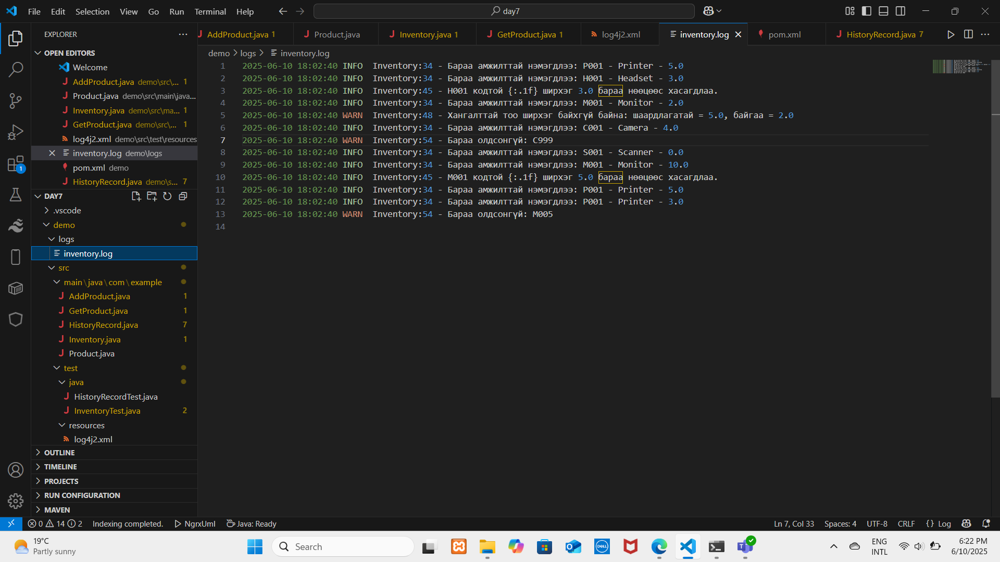

# Бараа удирдлагын систем
"Бараа удирдлагын систем" нь жижиг, дунд хэмжээний байгууллага, дэлгүүрт зориулсан барааны мэдээллийг удирдах зориулалттай. Энэ систем нь хэрэглэгч бүр өөрийн үйлдлийг тэмдэглэж, хэзээ, ямар бараа нэмсэн/авсныг бүртгэж, нөөц хяналтын процессыг автоматжуулж бараа бүрийн мэдээллийг хадгалах, шалгах, тайлагнахад хялбар болгох үйлдлүүдийг гүйцэтгэдэг. Системийн нь бараа бүртгэх, хадгалах бараа нэмж, нөөц нэмэгдүүлэх бараа авах үед тоо ширхэгийг хасах хэрэглэгч бүрийн үйлдлийн түүхийг хадгалах агуулахын одоогийн нөөцийн мэдээллийг жагсааж харуулах үүрэгтэй. 
  
Манай бүтээгдэхүүн Product, AddProduct, GetProduct, Inventory, HistoryRecord гэсэн 5 class -аас бүрдэж байгаа.

- Product класс нь нэгж бүтээгдэхүүний мэдээллийг хадгалах.

- Inventory класс нь нийт бараа бүтээгдэхүүний жагсаалтыг харуулах.

- HistoryRecord класс нь бүтээгдэхүүнтэй холбоотой үйлдлийн түүхийг хадгалдаг.

- AddProduct класс нь шинэ бүтээгдэхүүнийг системд нэмэх.

- GetProduct класс нь системээс тодорхой бүтээгдэхүүн авах үүрэгтэй.

Түүнчлэн Product, AddProduct, GetProduct классуудад хүчэнгүй оролтын тест, сөрөг тооны  exception шалгах үйлдлүүд тус бүр хийгдэж хэрэглэгчийн алдааг эрт илрүүлж, системийг найдвартай алдаагүй тооцоолол хийх боломжийг бүрдүүлсэн.

UML diagram:

Үр дүн: 

  

	
	
	
	
	
	
	
	
	
	

